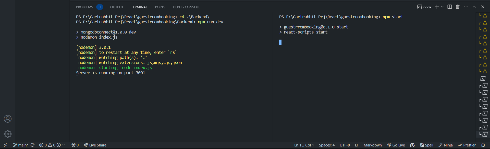
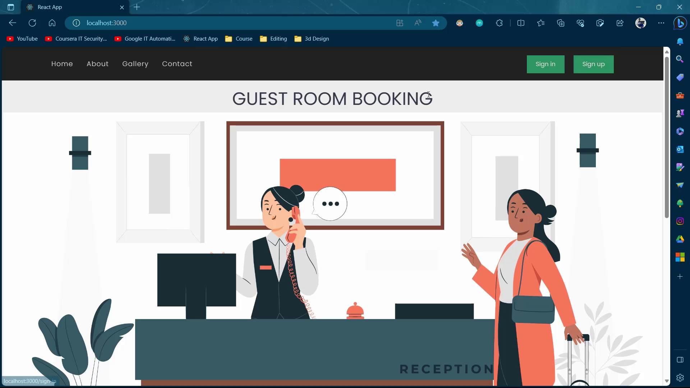
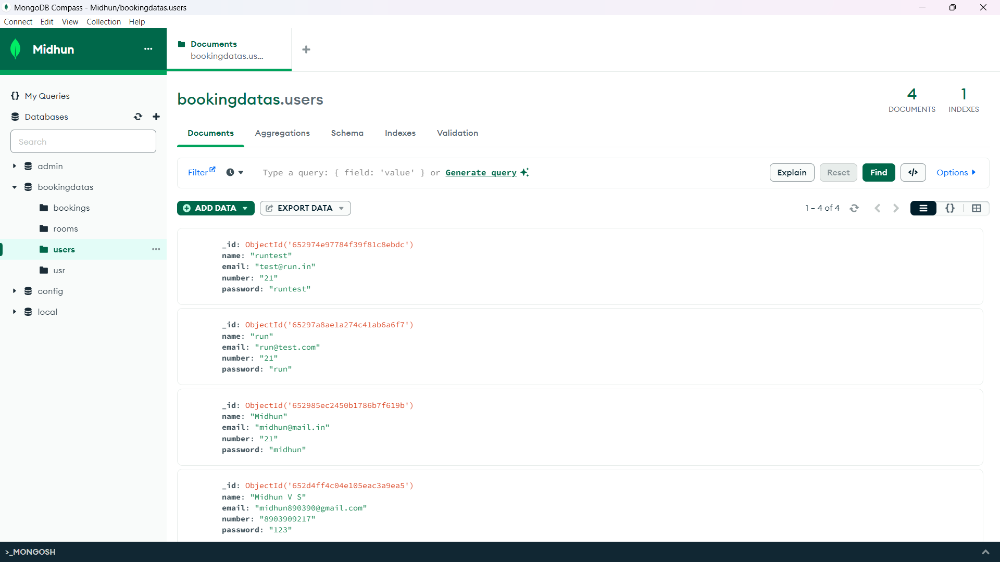

# Getting Started 

This project was done in React Js , Node Js and MongoDB Atlas.

# To Run
1. command "npm start" in the parent folder.
2. command "npm run dev" in the backend folder.

# The Output will be

# MongoDB Atlas Databse Collection

# Creator
Name : Midhun V S
Email: midhun890390@gmail.com
Mobile: 8903909217
